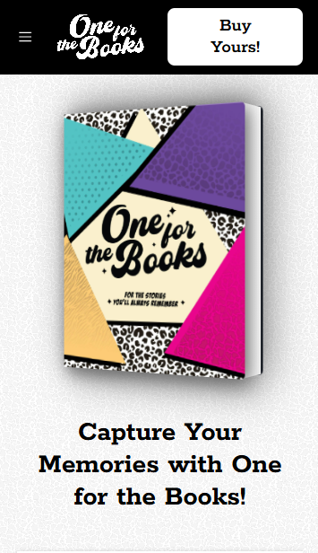

# 📚 OFTB — One For The Books

**One For The Books (OFTB)** is a thoughtfully designed **physical journal** for writers, thinkers, and creatives. The companion website — [forthebooks.co](https://forthebooks.co) — is a clean, modern landing page built to market and showcase the journal’s value and purpose.

---

## 🌐 Live Site

🔗 [forthebooks.co](https://forthebooks.co)

The site offers a digital preview of the experience behind the pages — highlighting the journal’s philosophy, features, and design in a calm, curated format.

---

## 🖥️💡 Responsive Design

The OFTB site is **fully responsive**, offering a seamless experience across devices:

- 📱 **Mobile-friendly layout**  
- 💻 **Optimized for desktops and tablets**  
- ⚙️ Built with **Tailwind CSS** for flexible, utility-based responsiveness

Try resizing your browser or visiting on your phone — the content adapts gracefully.

---

## 📸 Screenshots


### 🖥️ Desktop View (Hero Section)


### 📖 Product Showcase


### 📱 Mobile View


---

## 🛠️ Tech Stack

| Tool           | Purpose                    |
|----------------|----------------------------|
| React          | UI framework               |
| Vite           | Dev server & bundler       |
| Tailwind CSS   | Styling & responsive design|
| Lucide Icons   | Iconography                |
| React Router   | Page navigation            |

---

## 🚀 Getting Started

```bash
git clone https://github.com/ogmela/OFTB.git
cd OFTB
npm install
npm run dev
