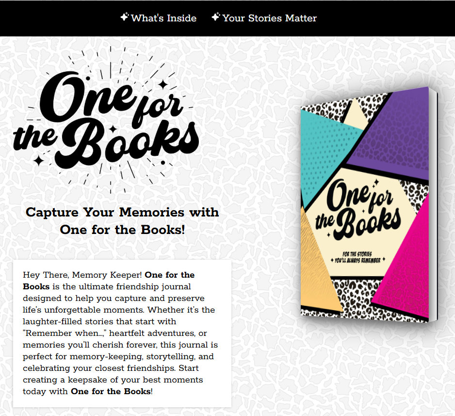
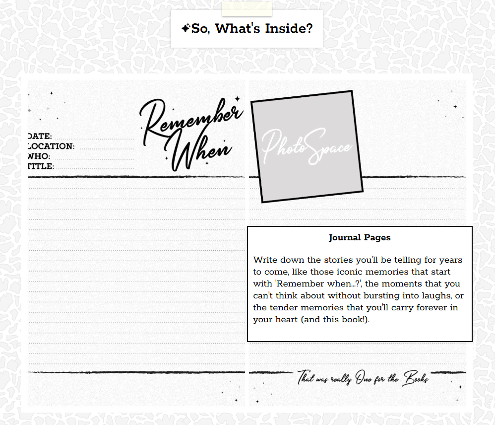

# 📚 OFTB — One For The Books

**One For The Books (OFTB)** is a thoughtfully designed physical journal made for writers, thinkers, and creatives. The companion website, [forthebooks.co](https://forthebooks.co), serves as a clean, modern marketing and product showcase for the journal.

---

## 🌐 Live Site

🔗 [forthebooks.co](https://forthebooks.co)

The site highlights the journal’s features, philosophy, and purpose — aiming to give potential buyers a feel for the experience before they ever turn a page.

---

## 📸 Screenshots

### 🏠 Landing Page


### 📖 Product Showcase


### 🧭 About the Journal


---

## 🛠️ Tech Stack

| Tool           | Purpose                    |
|----------------|----------------------------|
| React          | Frontend framework         |
| Vite           | Fast build + dev tooling   |
| Tailwind CSS   | Utility-first styling      |
| Lucide Icons   | Elegant iconography        |
| Netlify/Vercel | (Suggested) Hosting        |

---

## 🚀 Getting Started (Dev Setup)

```bash
git clone https://github.com/ogmela/OFTB.git
cd OFTB
npm install
npm run dev
